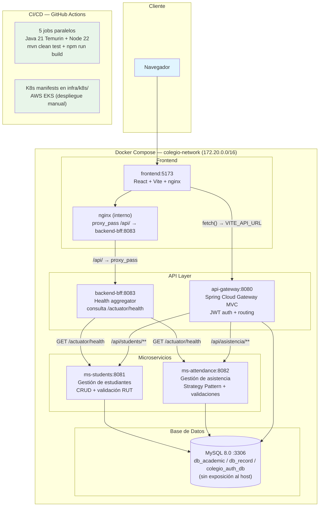

# Colegio O'Higgins Platform

Repositorio monorepo del proyecto de gestión académica para el Colegio Bernardo O'Higgins.
Arquitectura de microservicios con Spring Boot para el backend, React + Vite para el frontend
y Docker Compose para orquestación local.

[](https://github.com/franciscodiazu/colegio-ohiggins-platform/actions/workflows/ci.yml)
    
---

## Arquitectura



---

## Estructura del Proyecto

```
colegio-ohiggins-platform/
├── api-gateway/              # Spring Cloud Gateway MVC (auth + routing)
├── backend-bff/              # Backend for Frontend — health checker
├── ms-students/              # Microservicio estudiantes (CRUD + validación RUT)
├── ms-attendance/            # Microservicio asistencia (Strategy Pattern + Factory)
├── frontend/                 # React + Vite + Vitest
├── packages/
│   ├── ui/                   # Componentes UI compartidos (@colegio-ohiggins/ui)
│   └── maven-archetype-basic/# Arquetipo Maven para generar proyectos Java
├── Infra/
│   ├── docker/               # 6 Dockerfiles + nginx.conf
│   ├── mysql/init.sql        # Inicialización de bases de datos con least privilege
│   ├── docker-compose.yml    # Orquestación completa del stack
│   ├── .env                  # Variables de entorno reales (no versionado)
│   └── .env.example          # Template versionable con valores placeholder
├── infra/k8s/                # 15 manifests K8s para AWS EKS (ejemplo de CD)
│   ├── namespace.yaml
│   ├── configmap.yaml
│   ├── secret.yaml
│   ├── mysql/{deployment,service}.yaml
│   ├── ms-students/{deployment,service}.yaml
│   ├── ms-attendance/{deployment,service}.yaml
│   ├── api-gateway/{deployment,service}.yaml
│   ├── backend-bff/{deployment,service}.yaml
│   └── frontend/{deployment,service}.yaml
├── .github/workflows/
│   └── ci.yml                # CI pipeline — 5 jobs en paralelo
├── discovery-server/         # 🗑️ Placeholder — se excluyó por tiempo
├── docs/                     # Documentación académica
│   └── api-specifications/   # Especificaciones de API
├── repositorios.txt          # Accesos a los componentes del proyecto
└── package.json              # Scripts raíz (install:frontend, dev:frontend)
```

> **Nota sobre discovery-server/**: Contiene únicamente un directorio `src/` vacío.
> Se planeaba implementar un Service Registry con Eureka, pero se descartó
> por tiempo de desarrollo. Los microservicios se comunican por nombres
> DNS directos (Docker network) en lugar de descubrimiento dinámico.
> El directorio se conserva como referencia de la intención inicial.

---

## Prerrequisitos

- **Git** — Control de versiones
- **Java 21** (Temurin) — Entorno de ejecución Spring Boot
- **Maven** — Gestión de dependencias Java (se incluye `mvnw` en cada módulo para builds sin Maven global)
- **Node.js 18+** — Entorno de ejecución frontend
- **Docker Desktop** — Contenedores (requiere WSL2 en Windows)
- **Docker Compose** — Orquestación (incluido en Docker Desktop)

---

## Instalación y Ejecución

### 1. Clonar el repositorio

```bash
git clone https://github.com/franciscodiazu/colegio-ohiggins-platform.git
cd colegio-ohiggins-platform
```

### 2. Configurar variables de entorno (opcional)

```bash
# Windows
copy Infra\.env.example Infra\.env

# Linux / macOS
cp Infra/.env.example Infra/.env
```

El archivo `.env.example` contiene valores placeholder para desarrollo.
Las credenciales reales están en `.env` (no versionado — ver `.gitignore`).
No es estrictamente necesario para `docker-compose up` porque todas las
variables tienen valores por defecto en el archivo YAML.

### 3. Levantar el stack completo (recomendado)

```bash
docker-compose -f Infra/docker-compose.yml up --build
```

**Tiempo estimado (primera vez):** 8–15 minutos (descarga de imágenes
Docker + build de Maven + npm install).

**Tiempo estimado (subsecuente):** 2–4 minutos (todo cacheado).

### 4. Verificar que todo está funcionando

```bash
docker-compose -f Infra/docker-compose.yml ps
```

Seis servicios deben aparecer como `Up` o `healthy`:

```
colegio-mysql         Up (healthy)
colegio-ms-students   Up (healthy)
colegio-ms-attendance Up (healthy)
colegio-gateway       Up (healthy)
colegio-bff           Up (healthy)
colegio-frontend      Up (healthy)
```

### 5. Abrir en el navegador

```
http://localhost:5173
```

---

## Puertos y Endpoints

| Componente | Puerto Local | URL | Propósito |
|---|---|---|---|
| Frontend | 5173 | `http://localhost:5173` | Aplicación React (via nginx) |
| API Gateway | 8080 | `http://localhost:8080` | Proxy + autenticación JWT |
| ms-students | 8081 | `http://localhost:8081` | CRUD de estudiantes |
| ms-attendance | 8082 | `http://localhost:8082` | Gestión de asistencia |
| backend-bff | 8083 | `http://localhost:8083/api/bff/status` | Health check agregado |
| MySQL | — | Interno Docker | Sin exposición al host |

### Diagrama de flujo de peticiones

```
Navegador → http://localhost:5173
  ├── /api/*  → nginx (proxy_pass) → backend-bff:8083
  │                                  └── GET /actuator/health → ms-students:8081
  │                                  └── GET /actuator/health → ms-attendance:8082
  │
  └── fetch() → api-gateway:8080
                ├── /api/students/**  → ms-students:8081  (requiere JWT)
                ├── /api/asistencia/** → ms-attendance:8082 (requiere JWT)
                └── /api/v1/auth/*    → gateway (permitAll)
```

### Flujo de autenticación (JWT)

Registrar un usuario y obtener token:

```bash
# Registro (nombre + username obligatorios, role se asigna por defecto ESTUDIANTE)
curl -X POST http://localhost:8080/api/v1/auth/register \
  -H "Content-Type: application/json" \
  -d '{"nombre":"Admin","username":"admin","password":"123456"}'

# Login
TOKEN=$(curl -s -X POST http://localhost:8080/api/v1/auth/login \
  -H "Content-Type: application/json" \
  -d '{"username":"admin","password":"123456"}' \
  | python -c "import sys,json;print(json.load(sys.stdin)['token'])")

# Usar el token para peticiones autenticadas
curl -H "Authorization: Bearer $TOKEN" \
  http://localhost:8080/api/students/
```

---

## Documentación de API (Swagger / OpenAPI)

Tres de los cuatro servicios Java incluyen `springdoc-openapi-starter-webmvc-ui 2.8.8`
con Swagger UI precargada. El API Gateway no incluye springdoc.

### Endpoints por puerto directo

| Servicio | Swagger UI | OpenAPI Spec |
|---|---|---|
| ms-students | `http://localhost:8081/swagger-ui.html` | `http://localhost:8081/v3/api-docs` |
| ms-attendance | `http://localhost:8082/swagger-ui.html` | `http://localhost:8082/v3/api-docs` |
| backend-bff | `http://localhost:8083/swagger-ui.html` | `http://localhost:8083/api-docs` |
| api-gateway | ❌ No disponible | ❌ No disponible |

> **Importante**: El API Gateway (puerto 8080) requiere JWT para todas las rutas
> excepto `/api/v1/auth/login` y `/api/v1/auth/register`. Para explorar la
> documentación interactiva, usa los puertos directos de cada microservicio.
> El gateway no tiene rutas configuradas para Swagger.

---

## Calidad y Pruebas Unitarias

### Métricas de Cobertura (JaCoCo — instrucciones)

Generado con `mvn clean verify` el 22/06/2026:

| Módulo | Tests | Cobertura Instrucciones | Cobertura Ramas | Clases Analizadas |
|---|---|---|---|---|
| ms-students | 22 | 80% | 66% | 10 |
| ms-attendance | 101 | 84% | 75% | 20 |
| backend-bff | 9 | 83% | 100% | 4 |
| api-gateway | 9 | Sin JaCoCo | Sin JaCoCo | — |
| frontend (src/) | ~30 | ~28% (Vitest) | — | — |
| **Total** | **~171** | — | — | — |

### Generar reportes localmente

```bash
# Backend (JaCoCo HTML)
mvn clean verify -pl ms-students,ms-attendance,backend-bff
# → Abrir target/site/jacoco/index.html en cada módulo

# Frontend
cd frontend && npm run test:coverage
# → Abrir coverage/index.html
```

### Ejecutar todas las pruebas

```bash
# Backend (4 módulos)
mvn clean test -pl ms-students,ms-attendance,api-gateway,backend-bff

# Frontend
cd frontend && npm run test:coverage

# Stack completo (incluye tests durante build Docker)
docker-compose -f Infra/docker-compose.yml up --build
```

---

## Desarrollo Local (Sin Docker)

Para debuggear o modificar servicios sin levantar todo el stack:

```bash
# Terminal 1: Base de datos
docker run -d --name mysql-colegio -p 3306:3306 ^
  -e MYSQL_ROOT_PASSWORD=root ^
  -e MYSQL_DATABASE=db_academic ^
  mysql:8.0

# Terminal 2: ms-students
cd ms-students && ./mvnw spring-boot:run -DDB_HOST=localhost

# Terminal 3: ms-attendance
cd ms-attendance && ./mvnw spring-boot:run -DDB_HOST=localhost

# Terminal 4: api-gateway
cd api-gateway && ./mvnw spring-boot:run

# Terminal 5: backend-bff
cd backend-bff && ./mvnw spring-boot:run

# Terminal 6: frontend
cd frontend && npm run dev
```

---

## Integración Continua (CI)

### GitHub Actions

El archivo `.github/workflows/ci.yml` ejecuta 5 jobs en paralelo
sobre push o PR a `main`:

| Job | Tecnología | Comando |
|---|---|---|
| ms-students | Java 21 Temurin + Maven | `mvn clean test -B` |
| ms-attendance | Java 21 Temurin + Maven | `mvn clean test -B` |
| api-gateway | Java 21 Temurin + Maven | `mvn clean test -B` |
| backend-bff | Java 21 Temurin + Maven | `mvn clean test -B` |
| frontend | Node.js 22 + npm | `npm ci && npm run build` |

Características:
- Cache de dependencias Maven y npm
- Concurrencia: `cancel-in-progress: true` (solo el último push cuenta)
- Tiempo estimado: 3–5 minutos

> ✅ **Estado actual**: CI operativo y verificado. Pipelines pasan correctamente.

---

## Despliegue Continuo (CD) — Kubernetes

Los manifiestos en `infra/k8s/` son un **ejemplo de cómo llevar este
proyecto a AWS EKS**. No forman parte del stack local.

```bash
# Requiere: kubectl + cluster EKS configurado
kubectl apply -f infra/k8s/
```

Esto crea en el namespace `colegio-ohiggins`:

| Recurso | Réplicas | Puerto | Health Check |
|---|---|---|---|
| mysql | 1 (StatefulSet-like) | 3306 (ClusterIP) | `mysqladmin ping` |
| ms-students | 2 | 8081 (ClusterIP) | `/actuator/health` |
| ms-attendance | 2 | 8082 (ClusterIP) | `/actuator/health` |
| api-gateway | 2 | 8080 (ClusterIP) | `/actuator/health` |
| backend-bff | 2 | 8083 (ClusterIP) | `/actuator/health` |
| frontend | 2 | 8080 (LoadBalancer → :80) | `wget localhost:8080/` |

Las variables de entorno se inyectan via ConfigMap (valores no sensibles)
y Secret (contraseñas), replicando la misma estructura que `docker-compose.yml`.

---

## Troubleshooting

| Problema | Causa | Solución |
|---|---|---|
| `Connection refused` a MySQL | Puerto 3306 ocupado en host | Verificar con `netstat -ano \| findstr :3306`; cambiar `DB_PORT` en `.env` |
| Contenedor Java en restart loop | MySQL no listo aún — `start_period: 90s` | Esperar ~2 minutos; verificar con `docker logs colegio-ms-students` |
| `colegio-mysql` no levanta | Puerto 3306 ocupado o WSL2 sin recursos | `docker compose down -v && docker compose up` |
| Frontend muestra pantalla en blanco | `VITE_API_URL` incorrecto | En Docker: debe ser `http://api-gateway:8080`; en local: `http://localhost:8080` |
| Swagger devuelve 401 | Gateway bloquea sin JWT | Usar puerto directo del microservicio (8081, 8082, 8083) |
| `npm run build` falla en Docker | Carpeta `coverage/` residual | `rm -rf frontend/coverage` (Linux) o `Remove-Item -Recurse -Force frontend/coverage` (Windows) |
| `mvn clean test` falla | MySQL no corriendo localmente | Usar Docker Compose completo en vez de desarrollo local |
| JaCoCo report no se genera | Faltó `mvn clean verify` | Usar `mvn clean verify` (no `test`) para activar el plugin |

---

## Variables de Entorno

El proyecto se configura mediante variables de entorno definidas en
`Infra/.env` (no versionado). Usar `Infra/.env.example` como plantilla.

### Principales variables

| Variable | Default | Descripción |
|---|---|---|
| `DB_HOST` | `mysql` | Host de la base de datos (nombre del servicio Docker) |
| `DB_PORT` | `3306` | Puerto MySQL (interno Docker) |
| `DB_NAME_STUDENTS` | `db_academic` | Base de datos de estudiantes |
| `DB_NAME_ATTENDANCE` | `db_record` | Base de datos de asistencia |
| `DB_NAME_AUTH` | `colegio_auth_db` | Base de datos de autenticación |
| `DB_USERNAME` | `app_colegio` | Usuario de aplicación (least privilege) |
| `MS_STUDENTS_URL` | `http://ms-students:8081` | URL interna de ms-students |
| `MS_ATTENDANCE_URL` | `http://ms-attendance:8082` | URL interna de ms-attendance |
| `BFF_PORT` | `8083` | Puerto del backend-bff |
| `GATEWAY_PORT` | `8080` | Puerto del api-gateway |
| `VITE_API_URL` | `http://api-gateway:8080` | URL base para peticiones del frontend |
| `CORS_ALLOWED_ORIGINS` | `http://localhost:5173,...` | Orígenes permitidos para CORS |

### Roles de prueba

Basados en las validaciones de las pruebas unitarias de correo:

| Rol | Email |
|---|---|
| Alumno | `alumno@colegioohiggins.com` |
| Profesor | `profesor@colegioohiggins.com` |
| Apoderado | `apoderado@colegioohiggins.com` |

---

## Documentación del Proyecto

Los siguientes documentos se encuentran disponibles en la raíz o en la carpeta `docs/`:
- `ARQUITECTURA_MICROSERVICIOS.png`: Diagrama de la arquitectura del sistema.
- `DIAGRAMA_ER.png`: Modelo de entidad-relación de la base de datos.
- `PERSISTENCIA_DATOS.pdf`: Detalle técnico sobre la implementación de JPA y Hibernate.
- `INFORME_PRUEBAS_UNITARIAS.pdf`: Reporte detallado de cobertura y calidad de código.
- `repositorios.txt`: Listado de accesos a los repositorios de los componentes.

---

## READMEs por Módulo

Cada módulo tiene su propio README con información específica:

| Módulo | README |
|---|---|
| api-gateway | [api-gateway/README.md](./api-gateway/README.md) |
| backend-bff | [backend-bff/README.md](./backend-bff/README.md) |
| ms-students | [ms-students/README.md](./ms-students/README.md) |
| ms-attendance | [ms-attendance/README.md](./ms-attendance/README.md) |
| frontend | [frontend/README.md](./frontend/README.md) |
| packages/ui | [packages/ui/README.md](./packages/ui/README.md) |

---

## Licencia

Este proyecto es de uso académico para la asignatura DSY1106.
