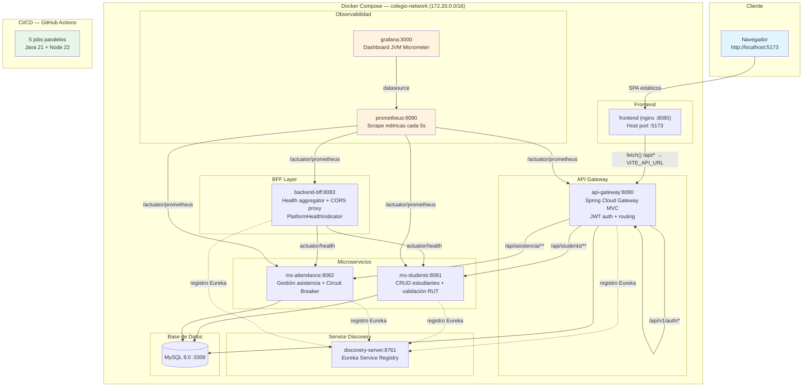

# Colegio O'Higgins Platform

Repositorio monorepo del proyecto de gestión académica para el Colegio Bernardo O'Higgins.
Arquitectura de microservicios con Spring Boot 3.5.13 para el backend, React + Vite para el frontend,
Docker Compose para orquestación local y Prometheus + Grafana para observabilidad.

[](https://github.com/franciscodiazu/colegio-ohiggins-platform/actions/workflows/ci.yml)

---

## Arquitectura



---

## Estructura del Proyecto

```
colegio-ohiggins-platform/
├── api-gateway/              # Spring Cloud Gateway MVC (auth + routing)
├── backend-bff/              # Backend for Frontend — CORS proxy + health aggregator (6 clases vivas post-v1.19)
├── ms-students/              # Microservicio estudiantes (CRUD + validación RUT)
├── ms-attendance/            # Microservicio asistencia (Strategy Pattern + Factory + CB)
├── frontend/                 # React + Vite + Vitest
├── packages/
│   ├── ui/                   # Componentes UI compartidos (@colegio-ohiggins/ui)
│   └── maven-archetype-basic/# Arquetipo Maven para generar proyectos Java
├── Infra/
│   ├── docker/               # 6 Dockerfiles + nginx.conf
│   ├── monitoring/           # prometheus.yml con targets a los 4 servicios
│   ├── mysql/init.sql        # Inicialización de bases de datos
│   ├── docker-compose.yml    # 9 servicios (7 core + prometheus + grafana)
│   ├── .env                  # Variables de entorno reales (no versionado)
│   └── .env.example          # Template versionable
├── infra/k8s/                # 17 manifests K8s para AWS EKS
├── .github/workflows/
│   └── ci.yml                # CI pipeline — 5 jobs en paralelo
├── discovery-server/         # Eureka Service Registry
├── docs/                     # Documentación académica EV3
│   ├── api-specifications/   # Especificaciones OpenAPI en JSON
│   ├── INFORME_AUDITORIA_EV3.md
│   ├── CHECKLIST_INFORME.md
│   ├── PLAN_EVOLUCION_TECNICA.md
│   ├── INFORME_INTEGRACION_EUREKA.md
│   ├── DESCRIPCION_PERSISTENCIA.md
│   ├── CASOS_DE_USO.md
│   └── REQUISITOS_SISTEMA.md
├── repositorios.txt
└── package.json
```

---

## Prerrequisitos

- **Docker Desktop** 24+ (con WSL2 en Windows)
- **Git** 2.40+
- **8 GB RAM mínimo** (16 GB recomendado para todo el stack)
- Navegador Chrome/Edge/Firefox actualizado

> No necesita Java, Maven ni Node.js instalados localmente — los contenedores Docker incluyen todo.

---

## Paso a Paso para el Profesor

### 1. Clonar el repositorio

```bash
git clone https://github.com/franciscodiazu/colegio-ohiggins-platform.git
cd colegio-ohiggins-platform
```

### 2. Levantar el stack completo

```bash
cd Infra
docker compose up --build -d
```

**Tiempo estimado (primera vez):** 10–15 minutos (descarga de imágenes base + build Maven de 5 módulos Java + npm install + build frontend).  
**Tiempo estimado (subsecuente):** 2–4 minutos (todo cacheado).

### 3. Verificar que 9/9 contenedores están healthy

```bash
docker ps --format "table {{.Names}}\t{{.Status}}"
```

Debe mostrar 9 contenedores, todos con estado `Up` o `(healthy)`:

```
discovery-server      Up (healthy)
colegio-mysql         Up (healthy)
colegio-ms-students   Up (healthy)
colegio-ms-attendance Up (healthy)
colegio-gateway       Up (healthy)
colegio-bff           Up (healthy)
colegio-frontend      Up (healthy)
colegio-prometheus    Up
colegio-grafana       Up
```

> Si algún contenedor aparece como `(unhealthy)`, esperar 30s más y repetir.  
> El backend-bff puede tardar hasta 2 minutos en estar healthy (depende de Eureka + MySQL).

### 4. Abrir la aplicación

| Componente | URL | Credenciales |
|------------|-----|-------------|
| Frontend (React) | [http://localhost:5173](http://localhost:5173) | Registrarse libremente |
| API Gateway | [http://localhost:8080](http://localhost:8080) | — |
| Eureka Dashboard | [http://localhost:8761](http://localhost:8761) | Sin autenticación |
| Prometheus Targets | [http://localhost:9090/targets](http://localhost:9090/targets) | — |
| Grafana | [http://localhost:3000](http://localhost:3000) | admin / admin |

### 5. Probar flujo completo de API

```bash
# 5a. Registrar un usuario (username debe ser email con @profesor.cl, @alum.cl o @apod.cl)
curl -s -X POST http://localhost:8080/api/v1/auth/register \
  -H "Content-Type: application/json" \
  -d '{"nombre":"Profesor Demo","username":"profesor@profesor.cl","password":"123456"}'

# 5b. Login para obtener JWT
TOKEN=$(curl -s -X POST http://localhost:8080/api/v1/auth/login \
  -H "Content-Type: application/json" \
  -d '{"username":"profesor@profesor.cl","password":"123456"}' \
  | python -c "import sys,json;print(json.load(sys.stdin)['token'])")
echo "Token: $TOKEN"

# 5c. GET estudiantes (autenticado)
curl -s -H "Authorization: Bearer $TOKEN" \
  http://localhost:8080/api/students/

# 5d. Crear estudiante (campos: rut_estudiante, nombre_completo, grado_academico)
curl -s -X POST -H "Authorization: Bearer $TOKEN" \
  -H "Content-Type: application/json" \
  -d '{"rut_estudiante":"12345678-5","nombre_completo":"Juan Perez","grado_academico":"1A"}' \
  http://localhost:8080/api/students/

# 5e. Verificar Prometheus — 4 targets deben estar UP
curl -s http://localhost:9090/api/v1/targets \
  | python -c "import sys,json;d=json.load(sys.stdin);[print(t['labels']['instance']+': '+t['health']) for t in d['data']['activeTargets']]"

# 5f. Verificar métricas JVM fluyendo
curl -s "http://localhost:9090/api/v1/query?query=jvm_memory_used_bytes" \
  | python -c "import sys,json;d=json.load(sys.stdin);print(str(len(d['data']['result']))+' series JVM metrics')"
```

### 6. Ver documentación Swagger

| Servicio | Swagger UI |
|----------|-----------|
| ms-students | [http://localhost:8081/swagger-ui/index.html](http://localhost:8081/swagger-ui/index.html) |
| ms-attendance | [http://localhost:8082/swagger-ui/index.html](http://localhost:8082/swagger-ui/index.html) |

> El API Gateway no expone Swagger. Usar los puertos directos de cada microservicio.

### 7. Ver monitoreo en vivo

1. Abrir **Prometheus** → [http://localhost:9090/targets](http://localhost:9090/targets) → verificar 4 targets UP
2. Abrir **Grafana** → [http://localhost:3000](http://localhost:3000) → `admin` / `admin`
3. En Grafana, ir a **Dashboards** → **JVM Micrometer** → ver métricas en vivo:
   - Uso de heap por servicio
   - Actividad de GC
   - Threads activos
   - Tasa de requests HTTP

### 8. Detener el sistema

```bash
docker compose down
```

Para eliminar también volúmenes de datos (base de datos + grafana):

```bash
docker compose down -v
```

---

## Puertos y Endpoints

| Componente | Puerto Local | URL | Propósito |
|---|---|---|---|
| Frontend (nginx) | 5173 | `http://localhost:5173` | Aplicación React |
| Discovery Server | 8761 | `http://localhost:8761/` | Eureka Dashboard |
| API Gateway | 8080 | `http://localhost:8080` | Proxy + JWT |
| ms-students | 8081 | `http://localhost:8081` | CRUD estudiantes |
| ms-attendance | 8082 | `http://localhost:8082` | Gestión asistencia |
| backend-bff | 8083 | `http://localhost:8083/actuator/health` | Health aggregator |
| Prometheus | 9090 | `http://localhost:9090/targets` | Métricas (4 targets) |
| Grafana | 3000 | `http://localhost:3000` | Dashboards (admin/admin) |
| MySQL | — | Interno Docker | Sin exposición al host |

---

## Servicios Docker y su Orden de Inicio

```
mysql (healthy) → discovery-server (healthy)
                    ↓
   ┌───────────────┼───────────────┐
   ↓               ↓               ↓
ms-students   ms-attendance    backend-bff
   ↓               ↓               ↓
   └────────────── api-gateway ────┘
                        ↓
                  frontend (nginx)
```

Dependencias con `depends_on` + `condition: service_healthy` garantizan el orden.

---

## Observabilidad (Prometheus + Grafana)

### Stack de monitoreo

| Componente | Rol | Configuración |
|---|---|---|
| **Micrometer** | Exposición de métricas en `/actuator/prometheus` | `management.metrics.tags.application` en cada service |
| **Prometheus** | Scraping cada 5s de 4 servicios Java | `Infra/monitoring/prometheus.yml` |
| **Grafana** | Dashboard JVM Micrometer (4701) | Datasource: `http://prometheus:9090` |

### 32 series JVM monitoreadas por servicio

- `jvm_memory_used_bytes` (heap + no-heap)
- `jvm_gc_pause_seconds`
- `jvm_threads_live_threads`
- `http_server_requests_seconds_count`
- `process_cpu_usage`
- Y más — 8 series por servicio × 4 servicios = 32 series total

### Para generar tráfico y ver métricas reaccionar

```bash
for i in 1 2 3 4 5; do
  curl -s -o /dev/null http://localhost:8080/api/v1/students/health
  curl -s -o /dev/null http://localhost:8083/actuator/health
  sleep 1
done
```

Luego en Grafana, dashboard JVM Micrometer muestra los picos en tiempo real.

---

## Calidad y Pruebas Unitarias

### Métricas de Cobertura (JaCoCo — instrucciones)

| Módulo | Tests | Cobertura Instr. | Cobertura Ramas |
|---|---|------------------|---|
| ms-students | 29 | 80%              | 66% |
| ms-attendance | 118 | 84%              | 75% |
| backend-bff | 17 | 77% | n/a |
| api-gateway | 9 | Sin JaCoCo       | Sin JaCoCo |
| discovery-server | 2 | Sin JaCoCo       | Sin JaCoCo |
| frontend (src/) | 349 | ~28% (Vitest)    | — |
| **Total** | **524** | —                | — |

### Ejecutar todas las pruebas localmente

```bash
# Backend (4 módulos, requiere Java 21 local)
cd api-gateway && ./mvnw clean test && cd ..
cd backend-bff && ./mvnw clean test && cd ..
cd ms-students && ./mvnw clean test && cd ..
cd ms-attendance && ./mvnw clean test && cd ..

# Frontend
cd frontend && npm ci && npm run test:coverage
```

O via Docker (las pruebas se ejecutan durante el build):

```bash
docker compose build
```

---

## Troubleshooting

| Problema | Causa | Solución |
|---|---|---|
| `Connection refused` a MySQL | Puerto 3306 ocupado | `netstat -ano \| findstr :3306`; cambiar `DB_PORT` en `.env` |
| Contenedor Java en restart loop | MySQL no listo aún | Esperar ~2 min; `docker logs colegio-ms-students` |
| `colegio-mysql` no levanta | Puerto 3306 ocupado o WSL2 sin recursos | `docker compose down -v && docker compose up` |
| Frontend pantalla en blanco | `VITE_API_URL` incorrecto | Docker: `http://api-gateway:8080`; local: `http://localhost:8080` |
| Swagger devuelve 401 | Gateway bloquea sin JWT | Usar puerto directo (8081, 8082) |
| BFF `(unhealthy)` | PlatformHealthIndicator no alcanza ms-attendance | Verificar `MS_ATTENDANCE_URL=http://ms-attendance:8082` en compose |
| Prometheus target DOWN | Imagen Docker desactualizada | `docker compose build` para reconstruir |
| `npm run build` falla en Docker | Carpeta `coverage/` residual | `Remove-Item -Recurse -Force frontend/coverage` (Windows) |

---

## Variables de Entorno

El proyecto se configura mediante variables de entorno definidas en `Infra/.env` (no versionado). Usar `Infra/.env.example` como plantilla.

### Principales variables

| Variable | Default | Descripción |
|---|---|---|
| `DB_HOST` | `mysql` | Host de la base de datos |
| `DB_PORT` | `3306` | Puerto MySQL |
| `MS_STUDENTS_URL` | `http://ms-students:8081` | URL interna ms-students |
| `MS_ATTENDANCE_URL` | `http://ms-attendance:8082` | URL interna ms-attendance |
| `VITE_API_URL` | `http://localhost:8080` | URL base frontend → gateway |
| `JWT_SECRET` | (valor fijo) | Secreto para firmar tokens JWT |

---

## Documentación EV3

Los siguientes documentos están disponibles en `docs/`:

| Documento | Contenido |
|---|---|
| `INFORME_AUDITORIA_EV3.md` | Auditoría completa con métricas, bugs, gap analysis |
| `CHECKLIST_INFORME.md` | Cobertura item por item de la pauta EV3 (60/61 = 98%) |
| `PLAN_EVOLUCION_TECNICA.md` | Roadmap V4: logging, alertas, excepciones globales |
| `INFORME_INTEGRACION_EUREKA.md` | Detalle de integración Eureka Service Discovery |
| `DESCRIPCION_PERSISTENCIA.md` | Estrategia Database per Service |
| `CASOS_DE_USO.md` | 4 casos de uso documentados |
| `REQUISITOS_SISTEMA.md` | Hardware, software, puertos, instalación |
| `api-specifications/` | Swagger specs en JSON |

---

## Nota Estimada EV3

| Componente | Peso | Logro | Nota |
|---|---|---|---|
| Encargo (5 ítems) | 30% | 100% | 3.00 / 3.00 |
| Defensa (CHECKLIST) | 70% | ~98% | 6.86 / 7.00 |
| **Nota Final** | **100%** | **60/61 items** | **6.90 / 7.00** |

Brecha restante: Ítem 45 (TypeScript en frontend — planificado V4).

---

## Licencia

Uso académico — Asignatura DSY1106 Fullstack III.
